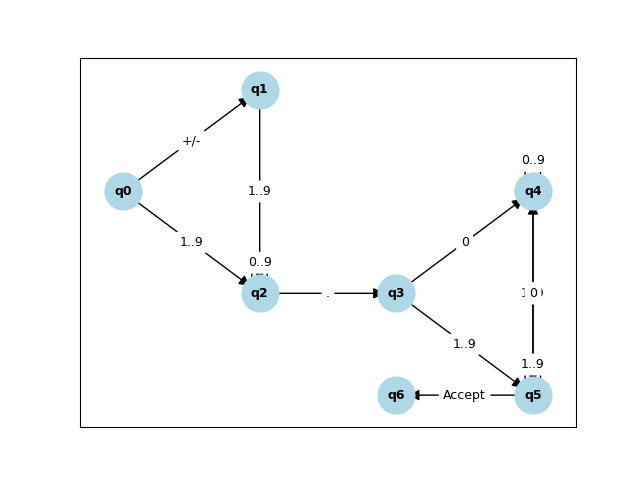

# Automaton for floating point number parsing

This automaton is designed to minimize the number of states and transitions on the parsing of floating point numbers.

## Regular Expression

The regular expression for a floating-point number is defined as follows:

```bash
(+|-)?([1,9][0,9]*\.[0,9]+[1,9]*)
```

## branch shaft

The branch shaft is the most common path that the automaton follows to parse a floating-point number.

```bash
E -> +T | -T | T
T -> 1..9D
D -> 0..9D | .F
F -> 0Z | 1..9Z
Z -> 0Z | 1..9Z | ε
```

## States and Transitions of the finite Automaton

### States

- **q0 (Init):** The initial state where the automaton begins processing.
- **q1 (Integer Part):** Processes digits that form the integer part of the number.
- **q2 (Sign):** Handles the optional sign (`+` or `-`) of the number.
- **q3 (Decimal Point):** Represents the transition to the fractional part.
- **q4 (Fractional Part):** Processes digits after the decimal point.
- **q5 (Leading Zero in Fraction):** Processes the initial `0` in the fractional part.
- **q6 (Accept):** The final state , indicating a valid floating-point number.

### Transitions

- **q0 -> q2:** On input `+` or `-`, the automaton transitions from `q0` to `q2`.
- **q0 -> q1:** On input `1..9`, the automaton transitions from `q0` to `q1`.
- **q2 -> q1:** On input `1..9`, the automaton transitions from `q2` to `q1`.
- **q1 -> q1:** On input `0..9`, the automaton remains in `q1` (loop for multiple digits).
- **q1 -> q3:** On input `.`, the automaton transitions from `q1` to `q3`.
- **q3 -> q5:** On input `0`, the automaton transitions from `q3` to `q5`.
- **q3 -> q4:** On input `1..9`, the automaton transitions from `q3` to `q4`.
- **q5 -> q5:** On input `0..9`, the automaton remains in `q5`.
- **q5 -> q4:** On input `1..9`, the automaton transitions from `q5` to `q4`.
- **q4 -> q5:** On input `0`, the automaton transitions from `q4` back to `q5`.
- **q4 -> q4:** On input `1..9`, the automaton remains in `q4`.
- **q4 -> q6:** On input [accepting condition], the automaton transitions to the accepting state `q6`.

### Diagram


*This diagram illustrates the state transitions within the automaton for processing floating-point numbers.*

## Optimizations

This automaton has to be optimized by the following techniques:

### Criteria of the Automaton

- **DFA (Deterministic Finite Automaton):** The automaton is deterministic
  - Single initial state.
  - Each state has exactly one transition for each symbol in the alphabet
  - No transitions to a dead state.

- **Minimized:** The automaton is minimized
  - The number of states is minimized.
  - The number of transitions is minimized.

- **Complete:** The automaton is complete
  - The automaton has transitions for all symbols in the alphabet.

## References

- [Regular Expression for Floating Point Numbers](https://www.regular-expressions.info/floatingpoint.html)
