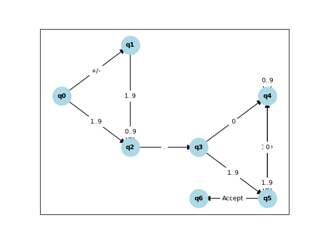

# Automaton for floating point number parsing

This automaton is designed to minimize the number of states and transitions on the parsing of floating point numbers.

## Regular Expression

The regular expression for a floating-point number is defined as follows:

```bash
^[+-]?(0|[1-9][0-9]*)\.[0-9]*[1-9]$
```

## branch shaft

The branch shaft is the most common path that the automaton follows to parse a floating-point number.

```bash
E  -> [+-]? N
N  -> I '.' F
I  -> '0' | [1-9][0-9]*
F  -> [0-9]* [1-9]

```

## States and Transitions of the finite Automaton

### States

- **q0 (Init):** Initial state.
- **q1 (Sign):** After reading an optional sign (`+` or `-`).
- **q2 (Integer Zero):** After reading `0` as the integer part.
- **q3 (Integer No-Zero):** While reading digits in the integer part.
- **q4 (Decimal Point):** After reading the decimal point `.`.
- **q5 (Fractional Part):** While reading zeros in the fractional part.
- **q6 (Fractional No-Zero):** After reading a non-zero digit in the fractional part.
- **q_accept (Accept):** Accepting state.
- **q_error (Error):** Rejecting state.

### State Transitions

- **q0 (Initial):**
  - On `+` or `-` → `q1`
  - On `0` → `q2`
  - On `[1-9]` → `q3`
  - Else → `q_error`

- **q1 (Sign):**
  - On `0` → `q2`
  - On `[1-9]` → `q3`
  - Else → `q_error`

- **q2 (Integer Zero):**
  - On `.` → `q4`
  - Else → `q_error`

- **q3 (Integer No-Zero):**
  - On `[0-9]` → `q3` (loop to consume integer digits)
  - On `.` → `q4`
  - Else → `q_error`

- **q4 (Decimal Point):**
  - On `0` → `q5`
  - On `[1-9]` → `q6`
  - Else → `q_error`

- **q5 (Fractional Zeroes):**
  - On `0` → `q5` (remain in `q5`)
  - On `[1-9]` → `q6`
  - On end of input → `q_error` (cannot end with zero)
  - Else → `q_error`

- **q6 (Fractional Non-Zero):**
  - On `[0-9]` → `q6` (consume fractional digits)
  - On end of input → `q_accept`
  - Else → `q_error`

- **q_accept (Accept):**
  - Input is accepted.

- **q_error (Error):**
  - Input is rejected; any input remains in `q_error`.

### Most Common Parsing Path

For performance optimization, we focus on the most common parsing path through the automaton, which is:

```bash
q0 → q3 → q3 → q4 → q6 → q_accept
q0 -> q1 -> q3 -> q3 -> q4 -> q6 -> q_accept # with sign '-'
```

### Diagram


*This diagram illustrates the state transitions within the automaton for processing floating-point numbers.*

## Optimizations

This automaton has to be optimized by the following techniques:

### Criteria of the Automaton

- **DFA (Deterministic Finite Automaton):** The automaton is deterministic
  - Single initial state.
  - Each state has exactly one transition for each symbol in the alphabet
  - No transitions to a dead state.

- **Minimized:** The automaton is minimized
  - The number of states is minimized.
  - The number of transitions is minimized.

- **Complete:** The automaton is complete
  - The automaton has transitions for all symbols in the alphabet.

## References

- [Regular Expression for Floating Point Numbers](https://www.regular-expressions.info/floatingpoint.html)
